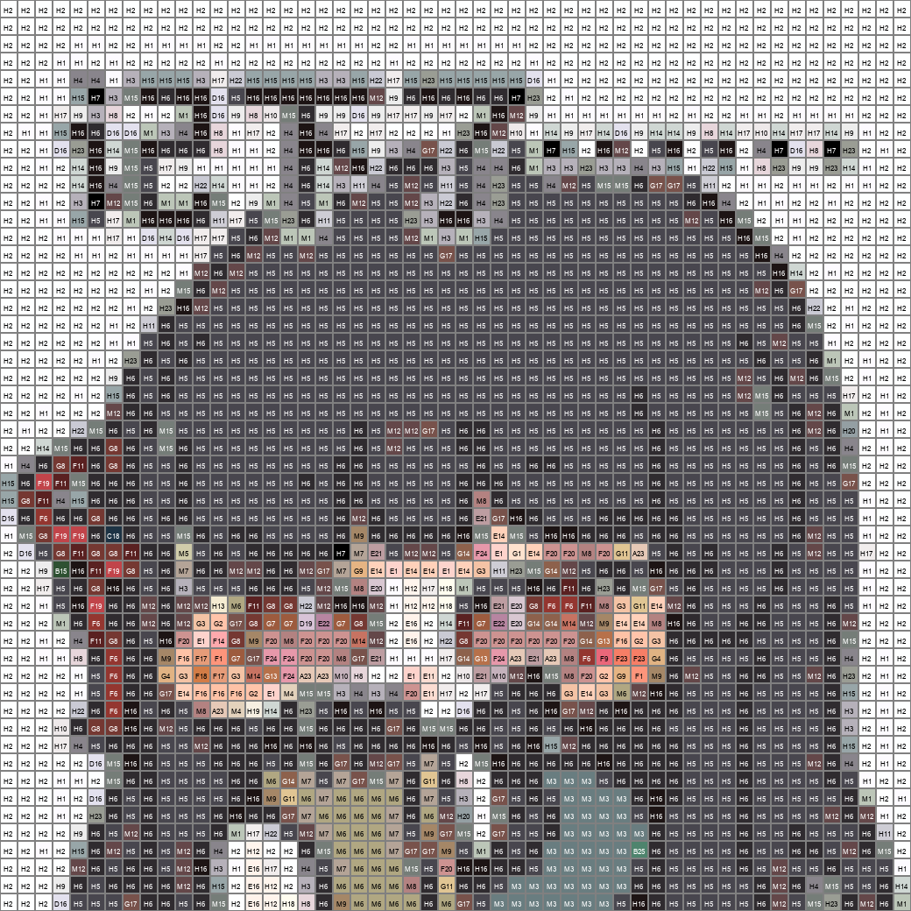

# 拼豆图片预处理工具

一个将图片转换为国产221色拼豆色卡映射的工具。

## 功能特点

- ✅ 支持图片降采样（默认长边52像素）
- ✅ 马赛克效果还原
- ✅ 国产221色拼豆色卡映射
- ✅ 颜色代码标注
- ✅ 色块数量统计（显示在结果图下方）

## 安装依赖

```bash
pip install pillow
```

## 使用方法

```bash
python main.py -i <输入图片路径> -o <输出文件夹> -s <分辨率>

# 示例
python main.py -i test_img.png -o output -s 52
```

### 参数说明

| 参数 | 缩写 | 说明 | 默认值 |
|------|------|------|--------|
| `--input` | `-i` | 输入图片路径 | 必填 |
| `--output` | `-o` | 输出文件夹路径 | 必填 |
| `--size` | `-s` | 下采样后长边分辨率 | 52 |

## 输出文件

运行后在输出文件夹中生成：

1. **low_res.png** - 低分辨率图（用于参考颜色）
2. **mosaic.png** - 马赛克效果原图（用于打印参考）
3. **color_map.png** - 颜色映射图（带颜色代码标注）

## 示例效果

### 输入图片


### 输出效果

#### 1. 低分辨率图 (low_res.png)


#### 2. 马赛克效果 (mosaic.png)


#### 3. 颜色映射图 (color_map.png)


### 运行示例

```bash
# 运行处理
python main.py -i test_images/img2.jpg -o test_images/img2_processed -s 48
```

### 颜色统计输出示例

```
原图尺寸：512 × 512
降采样尺寸：(48, 48)
已映射 2304 个像素点到国产221色拼豆色卡

国产221色拼豆颜色统计：
  A7: 2304 颗
```

## 代码结构

```
pindou/
├── main.py              # 命令行入口
├── pindou_processor.py  # 核心处理类
├── mard_colors.py       # 国产221色拼豆色卡
└── downsample.py        # 原始脚本
```

## 色卡说明

采用国产 MARD 221 色拼豆色卡，包含以下系列：

- **A系列 (A1-A26)** - 黄色、橙色、红色系
- **B系列 (B1-B32)** - 绿色系
- **C系列 (C1-C29)** - 蓝色系
- **D系列 (D1-D26)** - 紫色系
- **E系列 (E1-E24)** - 粉色系
- **F系列 (F1-F25)** - 红色、棕色系
- **G系列 (G1-G21)** - 肤色、金色系
- **H系列 (H1-H23)** - 灰色、白色、黑色系
- **M系列 (M1-M15)** - 混合色系

## 原理说明

1. **降采样**：将图片长边缩放到指定分辨率（默认52），使用 LANCZOS 算法保留细节
2. **颜色映射**：使用 RGB 欧几里得距离匹配最接近的拼豆颜色
3. **马赛克还原**：使用 NEAREST 最近邻插值还原到原尺寸，产生硬像素效果
4. **颜色标注**：在放大后的图片中标注每个色块的颜色代码
5. **色块统计**：统计每个颜色代码的使用数量，按数量排序后显示在结果图下方

## 许可证

MIT License